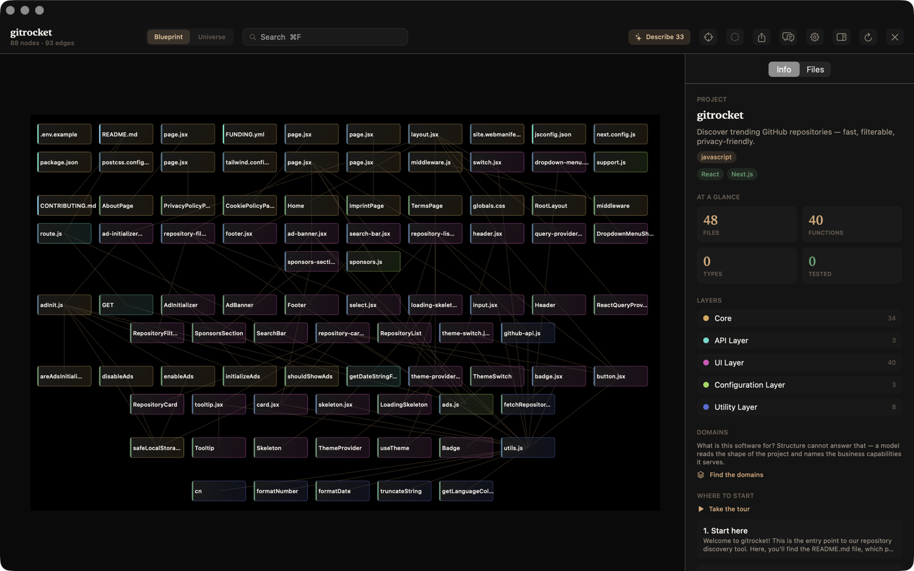
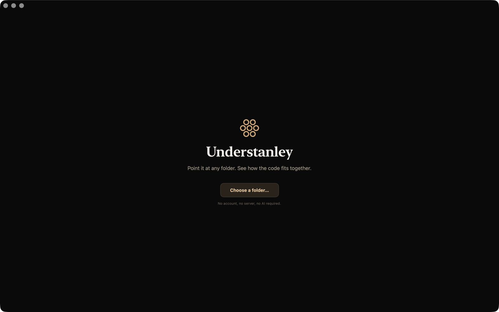
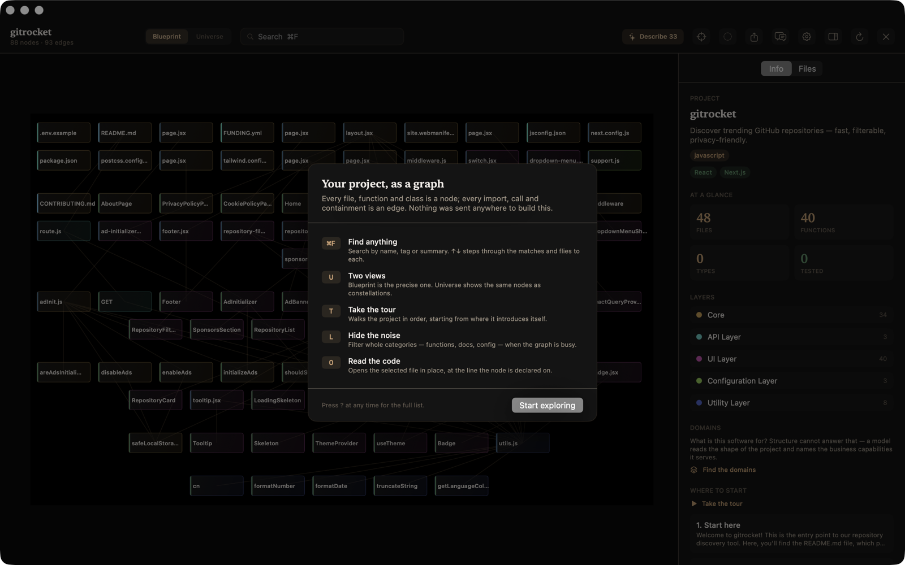
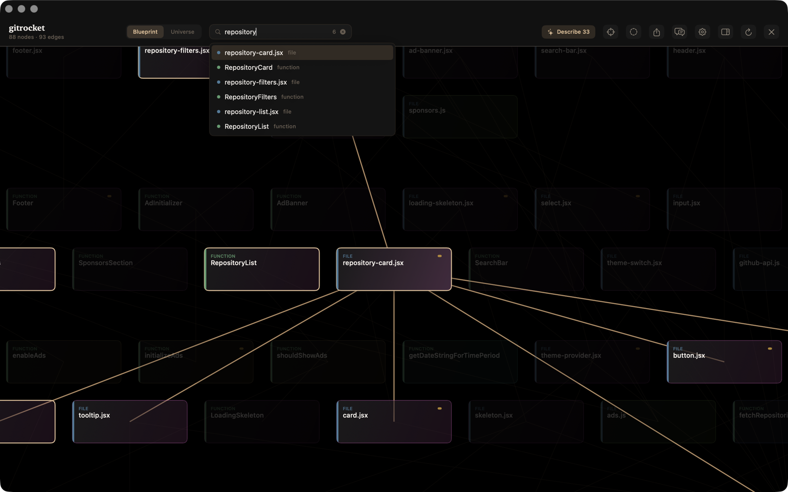
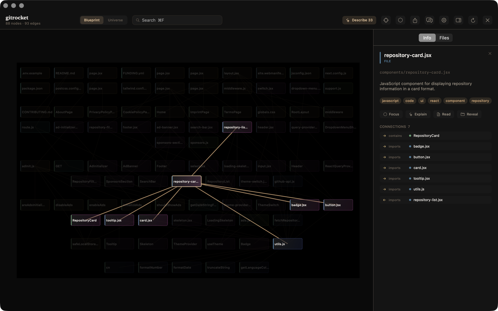
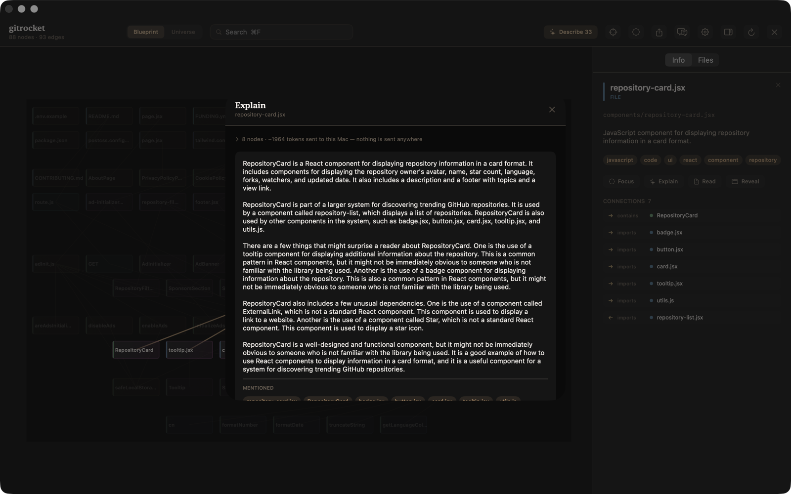
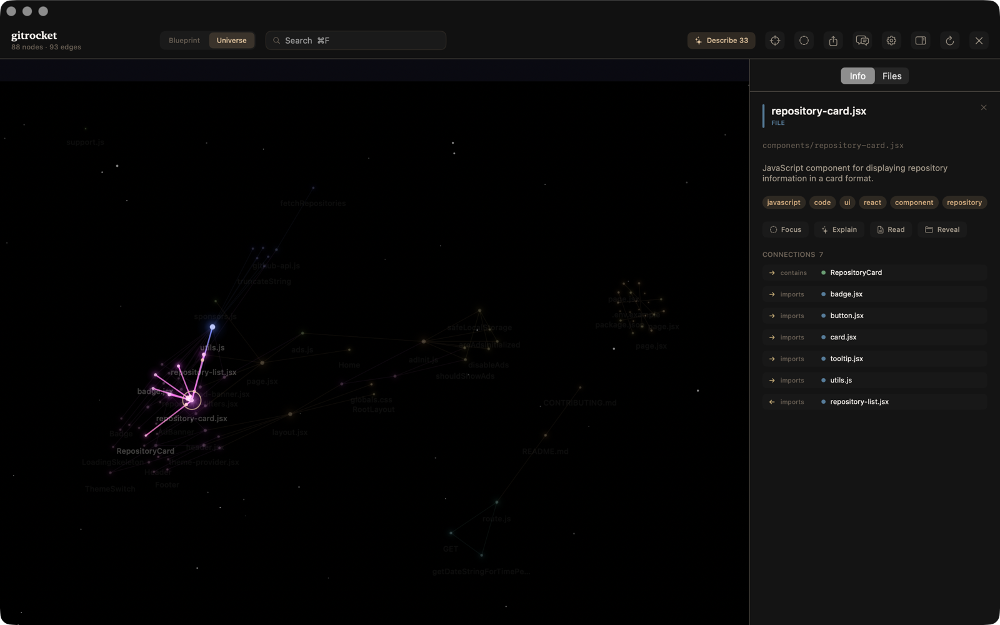
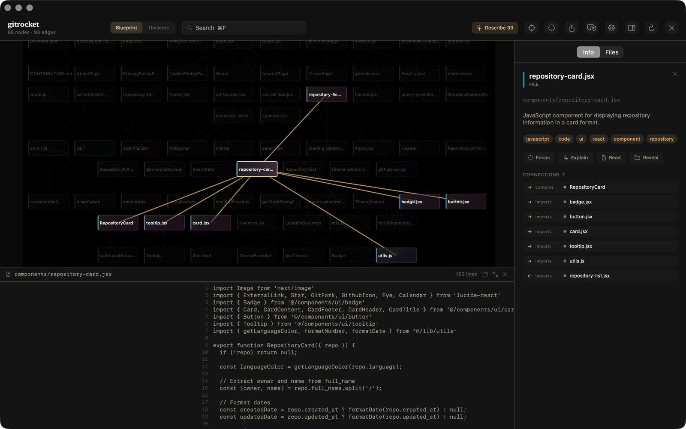
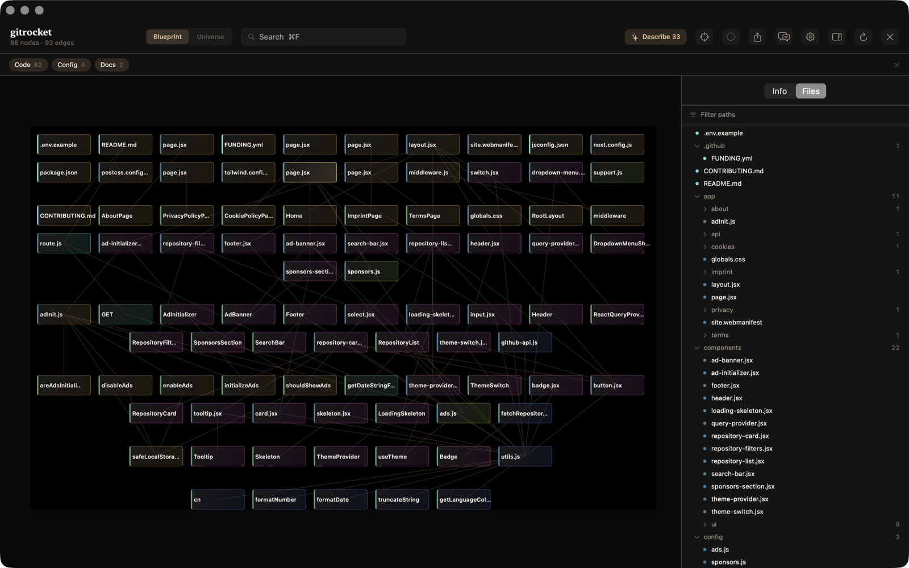
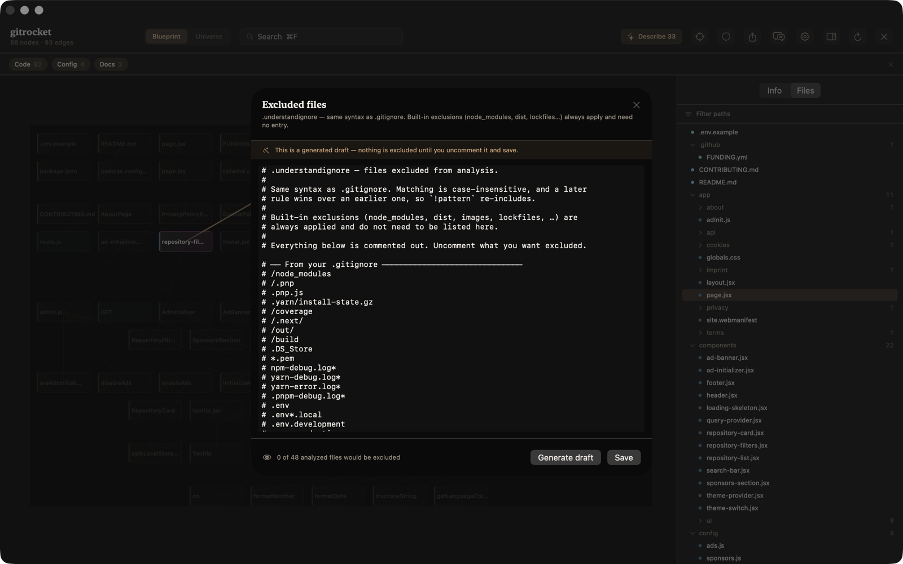

# Understanley

### The easy macOS desktop version of [Understand Anything](https://github.com/Egonex-AI/Understand-Anything)

**Point it at any folder. See how the code fits together.**

Understanley turns a codebase into a knowledge graph you can search, explore and read — in about a
second, offline, with no account, no server and no AI required. It is a native Mac app: double-click
it, pick a folder, and the graph is there.

**There is a ready-to-run
[`Understanley.dmg`](https://github.com/FutureWebservice/understanley/releases/latest) — 2.4 MB — or
you can build it from source in one command.** The DMG is not signed with a paid Apple certificate,
so a *downloaded* copy needs one extra click the first time; see [Download](#download).

<p align="center">
  
</p>

<p align="center">
  <a href="https://github.com/FutureWebservice/understanley/releases/latest"></a>
</p>

<p align="center">
  
  
  
  
  
</p>

---

## Contents

- [Why this exists](#why-this-exists)
- [Download](#download)
- [Quick start](#quick-start)
- [Every screen](#every-screen)
- [Features](#features)
- [Keyboard](#keyboard)
- [How it works](#how-it-works)
- [Privacy and security](#privacy-and-security)
- [Headless modes](#headless-modes)
- [Status and benchmarks](#status-and-benchmarks)
- [About the signature](#about-the-signature)
- [Support the project](#support-the-project)
- [Contributing](#contributing)
- [Security](#security)
- [Credits and licence](#credits-and-licence)

---

## Why this exists

[**Understand Anything**](https://github.com/Egonex-AI/Understand-Anything) — MIT, © Yuxiang Lin
and Infinite Universe, Inc., created by [Lum1104](https://github.com/Lum1104) and maintained under
[Egonex-AI](https://github.com/Egonex-AI) — is a genuinely good idea: turn any repository into an
interactive knowledge graph so you can *see* a codebase instead of grepping your way through it.

All the credit for the concept, the graph schema and the analysis approach belongs there. **This
project exists to make that idea easy to run.**

Upstream ships as a **Claude Code plugin**. `/understand` is a seven-phase prompt that a host coding
agent executes by dispatching LLM subagents, and the result is rendered by a React/Vite dev-server
dashboard. To see your first graph you install Claude Code, run a slash command, wait minutes, and
spend tokens.

Understanley is the same idea as **a Mac app you just open**. No agent, no Node, no dev server, no
tokens — and no waiting.

That trade runs both ways, and upstream wins several of them: it is **cross-platform**, it lives
where you already work if that is Claude Code, its prompt-driven phases are **far easier to extend
or retarget** than compiled Swift, and being agent-native it can reason about a repository in ways a
deterministic pipeline simply cannot. If you want a graph *inside* your agent workflow, use
Understand Anything. If you want one on your Mac in a second, use this.

That is possible because of one observation about upstream's own pipeline: **it splits cleanly in
two, and the deterministic half does almost all of the structural work.**

| Phase | Deterministic (pure code) | Needs a model |
|---|---|---|
| Scan | walk, language + framework detection, ignore rules | — |
| Analyze | functions, classes, imports, exports, call graph | summaries, tags |
| Merge | normalize, dedupe, `tested_by` linking | — |
| Layers | directory-pattern heuristics | narrative naming |
| Tour | topological ordering | narrative prose |
| Validate | four-tier schema validator | — |

A complete, navigable graph — 27 node types, 38 edge types, real import and call edges, layers, file
tree, search — is reachable in **seconds, offline, at zero cost**. A model only adds *prose*.

> **Layer** here means an architectural grouping — Core, UI, API, Configuration, Utility — inferred
> from directory conventions rather than declared anywhere. Layers are how Understanley colours and
> organises everything, so they are worth knowing about before the screenshots.

So the product inverts: Understanley is useful **before** any AI is configured, and enrichment is a
background upgrade rather than a gate.

### Interoperability is deliberate

Understanley reads and writes the *exact* upstream `.ua/knowledge-graph.json` schema. A graph the
plugin produced opens here with no conversion, and a graph made here opens in the upstream
dashboard. Node and edge types from upstream modes this app does not implement are still accepted on
read, so nothing fails to open.

**No lock-in in either direction — that is the point, not a side effect.**

---

## Download

**[Download Understanley.dmg →](https://github.com/FutureWebservice/understanley/releases/latest)**

Open the DMG, drag Understanley to Applications, done. Roughly 2.4 MB.

> **It is not signed with a paid Apple certificate**, so macOS will block the *first* launch with
> *"cannot be opened because the developer cannot be verified."* That message is about the absence of
> a certificate, not about the app — an unsigned build of anything gets it. One-time fix:
>
> - **macOS 15 (Sequoia) and later** — double-click, let it be blocked, then
>   **System Settings → Privacy & Security → Open Anyway**.
> - **macOS 14 and earlier** — right-click the app → **Open** → **Open**.
>
> Full explanation, and why it is unsigned, in [About the signature](#about-the-signature). If you
> would rather not trust a binary at all, build it yourself — that is one command below.

---

## Quick start

Don't want the [DMG](#download)? Build it instead — one command, and no Gatekeeper prompt at all,
because a locally built app is never quarantined:

```bash
git clone https://github.com/FutureWebservice/understanley.git
cd understanley
./build.sh              # → Understanley.app + Understanley.dmg
open Understanley.app
```

Then: **⌘O**, pick any folder, and read the graph.

**Requirements** — macOS 13 or later on Apple silicon to run (Intel Macs work when you build from
source), Xcode 15 / Swift 5.9 to build. Apple Intelligence
(the on-device AI option) needs macOS 26+. Nothing else to install; there are no package
dependencies to fetch.

> **First launch:** the app is not signed with a paid Apple certificate. Built on your own machine
> it opens normally. See [About the signature](#about-the-signature).

---

## Every screen

### 1 · Open anything



Pick a folder. Any folder — it does not need to be a git repository, and it does not need to be
code. There is nothing to configure and nothing to sign into. The line under the button is the whole
promise: *no account, no server, no AI required*.

### 2 · First run explains itself



Shown once, then never again. Five things worth knowing, each tied to the key that does it. Someone
who learns only ⌘F and `T` can drive the whole app.

### 3 · Blueprint — the working view


Every file, function and class is a node; every import, call and containment is an edge. Here that
is **88 nodes and 131 edges from 48 files, built in 0.17 s**, with nothing sent anywhere.

The header reads *93 edges* because the renderer collapses parallel edges — an exported function is
joined to its file by both `contains` and `exports`, and drawing two lines in the same place makes
the graph look denser than it is. All 131 stay in the JSON, because that is what upstream writes.

Each card carries two colours answering two different questions: the **left bar is the node type**
(file, function, config, document), and the **tint and border are the layer** it belongs to — Core
gold, UI magenta, Config green, API teal. Layers are the app's main organising idea, so they are
visible at a glance rather than buried in a legend.

### 4 · Search that goes somewhere



⌘F, weighted across name, tags, summary and language notes. Results drop down under the field,
**↑ ↓ steps through them and flies the camera to each**, and the graph dims everything that is not a
match. Counting matches was never the point — reaching them was.

### 5 · The AI analysis



Select any node. The summary and tags below were written by **Apple Intelligence running on this
Mac** — the framework is on-device, so the source excerpt never left the machine:

> **repository-card.jsx** — *"JavaScript component for displaying repository information in a card
> format."*
> `javascript` `code` `ui` `react` `component` `repository`

Connections are typed and directional, not just a list of names — `→ contains RepositoryCard`,
`→ imports badge.jsx`, `← imports repository-list.jsx` — so the panel answers *how* two things
relate, not merely *that* they do.

The same pass rewrites the layer descriptions to be about **this** project rather than about layers
in general:

> **API Layer** — *"This layer handles the HTTP requests and responses for the gitrocket
> application, providing endpoints for users to discover and filter trending GitHub repositories."*
>
> **UI Layer** — *"This layer is responsible for the user interface of the gitrocket application,
> including the layout, styling, and functionality of the search bar, repository cards, and other UI
> components."*

### 6 · Explain — a real answer, on-device



Ask about anything selected. Context is assembled from the **graph** — the node, its neighbourhood,
bounded source excerpts — rather than by dumping files at a model.

Note the disclosure line: **"3 nodes · ~1964 tokens sent to this Mac — nothing is sent anywhere."**
Every provider states its destination before it is used, and the row expands to show exactly what
would be sent.

### 7 · Universe — the overview



Press `U`. The same nodes, force-directed in deep space, morphing between the two geometries over
about a second. Nodes become luminous bodies sized by connection degree; hue is derived from the
layer by the golden angle, so any number of layers stays maximally separated and each reads as its
own constellation. Selecting a node lights its neighbourhood and dims the rest.

### 8 · Read the code in place



Press `O`, or click a file in the tree. The real source, with the selected node's own line span
highlighted and scrolled to. Only files the current graph lists are readable, and each path is
re-checked for traversal before it opens — a `.ua/knowledge-graph.json` can be written by anyone, so
being listed in one is not permission.

### 9 · Files and filters



The **Files** tab is the project as a path tree, with counts per folder and a live path filter.
Above the canvas, **filter chips hide whole categories**. On gitrocket the graph is 42 files, 40
functions, 4 config files and 2 documents — hiding `Code` leaves the six config and doc nodes alone
on screen, which is the fastest way to answer "what configures this project?".

### 10 · Choose what gets analyzed



`X` opens the `.understandignore` editor. It generates a draft from your `.gitignore` plus this
project's test conventions — and **everything it generates is commented out**. The file is a menu,
not a policy; silently excluding a third of a project because `.gitignore` mentioned it would
produce a graph that is wrong in a way you cannot see.

The footer counts the effect live — *"0 of 48 analyzed files would be excluded"* — so a rule that
matches nothing, or everything, is visible before you save rather than after a re-analysis.

---

## Features

### Analysis — deterministic, offline, free

- **16 code languages**: TypeScript, JavaScript, Python, Go, Rust, Java, Ruby, PHP, Swift, Kotlin,
  Scala, C, C++, C#, Dart, Lua — plus shell and PowerShell
- **12 non-code extractors**: Markdown, YAML, JSON, TOML, `.env`, Dockerfile, SQL, GraphQL,
  protobuf, Terraform, Makefile, HTML/CSS — 28 extractors registered in total
- **Import resolution that actually resolves**: TypeScript `paths` aliases, NodeNext extension
  rewriting, `jsconfig.json`, Python dot-counting, Go modules, PSR-4, Java/Kotlin/Scala/C# type
  indices, Swift package targets
- Call graph, `tested_by` coverage pairing by convention, architectural layer detection, guided-tour
  ordering, framework detection
- Four-tier schema validation that **repairs rather than rejects**, and reports every correction

### Two views

- **Blueprint** — layered Sugiyama, orthogonal edges, cards that show type, name, summary and
  complexity as soon as they are big enough to hold them
- **Universe** — Barnes-Hut force layout, additive glow, parallax starfield, layer constellations
- Both are computed on load, so switching **morphs** rather than reloads

### Navigation

⌘F search with a result list, arrow-key stepping and camera fly-to · category filters · file tree ·
code viewer · path finder · guided tour player · focus mode · full keyboard map (`?`)

### AI — optional, and never a gate

| Provider | Transport | Auth |
|---|---|---|
| **Apple Intelligence** | on-device, macOS 26+ | none — nothing leaves the Mac |
| Claude Code CLI | `claude -p` | existing sign-in |
| OpenAI Codex CLI | `codex exec` | existing sign-in |
| Anthropic API | HTTP | API key |
| OpenAI API | HTTP | API key |
| OpenRouter | HTTP | API key |
| Ollama | HTTP, localhost | none |
| Custom endpoint | HTTP, either wire format | optional |

Enrichment is progressive, resumable and crash-safe. Batches merge into the live graph as they land,
and every description is journaled **per node**, so it is written once and then survives
re-analysis, a provider switch, an app update and a reopen. Node explain and graph-context ask use
the same providers.

### Keeping up with changes

- **Diff mode** — changed files ring red, blast radius amber
- **Staleness banner** distinguishing fresh / dirty / behind / ahead / diverged
- **Opt-in auto-update** — watches the tree and re-analyzes only when the change was *structural*; a
  reformat or a comment rebuilds nothing

### Other modes

- **Wiki mode** for [Karpathy-pattern](https://gist.github.com/karpathy/442a6bf555914893e9891c11519de94f)
  markdown knowledge bases — articles, wikilinks, topics, sources
- **Domain view** — an optional model pass that names the business capabilities the code serves
- **Export** — filtered JSON, SVG, PNG, and a **self-contained HTML** viewer that works offline with
  no dependency on this app

---

## Keyboard

| | |
|---|---|
| **View** | |
| `U` | Switch between Blueprint and Universe |
| `0` | Fit the whole graph on screen |
| `F` | Focus the selection and its neighbours |
| `D` | Highlight what changed, and what depends on it |
| `I` | Show or hide the inspector |
| `L` | Filter by category — hide functions, docs, config… |
| `X` | Choose which files are excluded from analysis |
| **Navigate** | |
| drag / scroll | Pan · ⌘scroll or pinch to zoom |
| click | Select a node |
| `⌘F` | Search — ↑↓ steps through results, ↩ keeps one |
| `T` | Take the guided tour — ←→ steps through it |
| `P` | Path finder: press on one node, then on another |
| `esc` | Back out: viewer, path, tour, search, focus, selection |
| **Do** | |
| `A` | Ask a question about this codebase |
| `E` | Explain the selection — or export, with nothing selected |
| `O` | Read the selected file |
| `⌘R` | Re-analyze the project |
| `⌘O` | Open another project |
| `,` | AI provider settings |
| `?` | This list, in the app |

---

## How it works

```
folder → scan → extract → resolve imports → build graph → layout → draw
                                                 ↓
                                    .ua/knowledge-graph.json
                                                 ↓
                                     (optional) AI enrichment
```

**Scan** prefers `git ls-files` and falls back to a bounded walk, applying layered ignore rules.
**Extract** runs a per-language structure extractor over each file. These are careful regex
extractors working over a comment- and string-aware view of the source, not full parsers — the same
approach upstream takes, and enough for top-level declarations, imports and exports. They degrade to
a bare file node rather than failing when they meet something they do not understand, and they sit
behind a protocol so a real parser could replace one without touching anything else. **Resolve** turns every import
statement into the project file it actually refers to. **Build** assembles nodes and edges, links
tests to the code they cover, and detects architectural layers. Everything to that point is pure,
deterministic Swift — no network, no model, no configuration.

The renderer never touches the graph model. On load it is compiled once into a
**structure-of-arrays** form — parallel `Float`/`Int32` arrays with CSR adjacency — so the draw loop
has no reference counting, no dictionary lookups and no optional unwrapping. It is the single
largest performance decision in the app; the 1 453-node graph in the table below lays out in 0.31 s
and pans without dropping frames on an M-series Mac.

**Zero dependencies, deliberately.** `Package.swift` has no `dependencies:` array. The layout
engines, JSON handling, extractors, Keychain access and HTTP clients are all Swift and system
frameworks. This is not asceticism — it is why the app is 6 MB, starts instantly, builds in 25
seconds and can be audited by one person in an afternoon. People point this at private source code;
being auditable matters more than being convenient to write.

---

## Privacy and security

- **Nothing leaves your machine unless you enable AI**, and then only to the provider you picked.
  Every provider names its destination before first use, and the request panel shows exactly what
  would be sent.
- **Apple Intelligence runs entirely on-device.** No network at all.
- **Secrets live in the Keychain** — never in `UserDefaults`, never in the graph, never in a log.
  Keys are write-only in the UI: you can set or clear one, never read it back.
- **Custom endpoints must be `https://`**, or `http://` on loopback for a local model server. Plain
  HTTP to a remote host is refused rather than silently shipping source code in cleartext.
- **Project content is data, never instructions.** README and manifest text carries
  untrusted-content framing into every prompt.
- **The code viewer's allowlist is a security boundary.** Only files the current graph lists can be
  opened, and each path is re-checked for traversal — a graph file can be written by anyone.
- **No telemetry, no analytics, no update pings.** There is no server to talk to.

**What it writes to disk.** Analysing a project creates a `.ua/` directory inside it, holding
`knowledge-graph.json` (the graph), `meta.json`, `analyzer-version`, and — once you use AI —
`enrichment-journal.json` so a description is never paid for twice. That is the same location and
format upstream uses, which is what makes the two interoperable. Nothing is written anywhere else;
delete `.ua/` and the next analysis simply rebuilds it. Add it to your `.gitignore` if you would
rather not commit it.

---

## Headless modes

The canvas cannot be asserted about in a unit test, so everything underneath it runs without a
window:

The binary lives at `.build/release/Understanley` after a build, or inside the app bundle at
`Understanley.app/Contents/MacOS/Understanley`. Add it to your `PATH`, or call it by path:

```bash
./.build/release/Understanley --analyze <path>

# the rest, shortened for readability:
Understanley --analyze <path>              # nodes, edges, layers, timing
Understanley --layout <path>               # bounds, overlaps, edge crossings, timing
Understanley --inspect <root> <file>       # what the extractor and resolver saw in one file
Understanley --enrich <path> [--provider]  # a real describe pass, bounded
Understanley --domains <path>              # derive business domains
Understanley --export <path> <outdir>      # all four export formats
Understanley --ondevice-probe "<prompt>"   # one Apple Intelligence request, reported verbatim
```

`--ondevice-probe` is the diagnostic for on-device AI: it prints the raw response or the concrete
error type, which is how you tell "the model declined" from "the model is not available".

---

## Status and benchmarks

Current version **0.1.0** — first public release; see [CHANGELOG.md](CHANGELOG.md). Everything documented above is built, tested and
working.

Measured on an M-series Mac, release build:

| Project | Files | Nodes | Edges | Analysis | Blueprint layout | Universe layout |
|---|---|---|---|---|---|---|
| gitrocket (Next.js, JS) | 48 | 88 | 131 | 0.17 s | &lt;0.001 s | 0.007 s |
| This repo (Swift) | 87 | 815 | 2 357 | 0.33 s | 0.002 s | 0.35 s |
| Understand-Anything (TS + Python + docs) | 471 | 1 453 | 3 190 | 1.29 s | 0.001 s | 0.31 s |

**136 tests passing. Zero warnings on a clean release build under `-strict-concurrency=complete`.
Zero dependencies.** A 5.9 MB app and a 2.4 MB DMG.

**Scope:** Figma/design mode and multi-language UI translation from upstream are not implemented and
are not planned. Their node and edge types are still accepted on read, so a graph containing them
opens fine.

---

## About the signature

**Understanley is not signed with a paid Apple certificate.** It is ad-hoc signed instead.

This is the first app released under this name, and it ships as **open source you build yourself**.
That path costs you nothing, needs no trust in a binary you did not compile, and is the supported
way to run it today.

**What that means in practice**

**Building it yourself just works** — a locally built app is never quarantined, so there is nothing
to work around.

The [released DMG](https://github.com/FutureWebservice/understanley/releases/latest) is a different
matter. macOS marks any downloaded file as quarantined, and Gatekeeper then refuses the first launch
with *"cannot be opened because the developer cannot be verified."* That message is about the
absence of a paid certificate, not about the app — **an unsigned build of anything gets it.**

To open a downloaded build:

**macOS 14 and earlier** — right-click (or Control-click) the app → **Open** → **Open**. Once only.

**macOS 15 (Sequoia) and later** — Apple removed that shortcut for unsigned apps. Double-click it
once and let it be blocked, then go to **System Settings → Privacy & Security**, scroll down, and
press **Open Anyway** next to the message about Understanley.

Either way, or on any version, you can clear the quarantine flag directly:

```bash
xattr -dr com.apple.quarantine /Applications/Understanley.app
```

**What would remove the prompt**

A Developer ID certificate from the paid Apple Developer Program (99 USD/year) plus Apple's
notarisation service. That is the plan — see below — but it is not a reason to hold the code back in
the meantime.

---

## Support the project

If Understanley is useful to you and you would like to see it signed and notarised so it opens with
a normal double-click, that is exactly what support goes toward:

**First goal: an Apple Developer Program membership** (99 USD/year), so every release is properly
signed and notarised and nobody has to right-click anything.

Until then the source build is the supported path — and it will stay supported afterwards too.
Signing is about convenience for people who would rather not compile; it is not about locking
anything down.

<p align="center">
  <a href="https://buymeacoffee.com/futurewebservice"></a>
</p>

There is also a **Sponsor** button at the top of this repository. Starring it and filing good bug
reports help just as much and cost nothing.

---

## Security

Found a security problem? Please report it privately — see [SECURITY.md](SECURITY.md). The code
viewer's path allowlist and the "nothing leaves without saying so" rule are the two boundaries most
worth testing.

## Contributing

See [CONTRIBUTING.md](CONTRIBUTING.md). The short version:

- **No dependencies.** If a change seems to need a package, let's talk about it first.
- **Zero warnings.** `-strict-concurrency=complete` is on; a data race is a build error.
- **Check that something calls your new code** before calling it done. Several features in this
  project were once written, reviewed and never reachable:

  ```bash
  grep -rn "\bmyNewFunction\b" Sources/ Tests/ | grep -v "func myNewFunction"
  ```

### Reporting a bug

Open an [issue](../../issues). The most useful report includes:

- what you expected and what happened instead
- your macOS version, and whether AI was enabled (and which provider)
- the output of `Understanley --analyze <path>` on the project that misbehaved

If the graph itself looks wrong — a missing edge, a file that should not be there — `--inspect
<root> <file>` on the offending file shows exactly what the extractor and resolver saw, and is worth
a thousand words.

---

## Credits and licence

**Understanley stands on [Understand Anything](https://github.com/Egonex-AI/Understand-Anything).**
The concept, the knowledge-graph schema, the analysis pipeline and the visual language are theirs —
this project reimplements them natively for macOS so the idea is a double-click away.

- Understand Anything — MIT, © 2026 Yuxiang Lin and Infinite Universe, Inc.
- Created by [Lum1104](https://github.com/Lum1104); maintained under
  [Egonex-AI](https://github.com/Egonex-AI)

No upstream source code is bundled or copied verbatim. The on-disk format is kept byte-compatible
deliberately, so graphs move freely between the two projects. Understanley is not affiliated with or
endorsed by Egonex-AI. See [NOTICE](NOTICE).

Understanley itself is MIT licensed — see [LICENSE](LICENSE).
